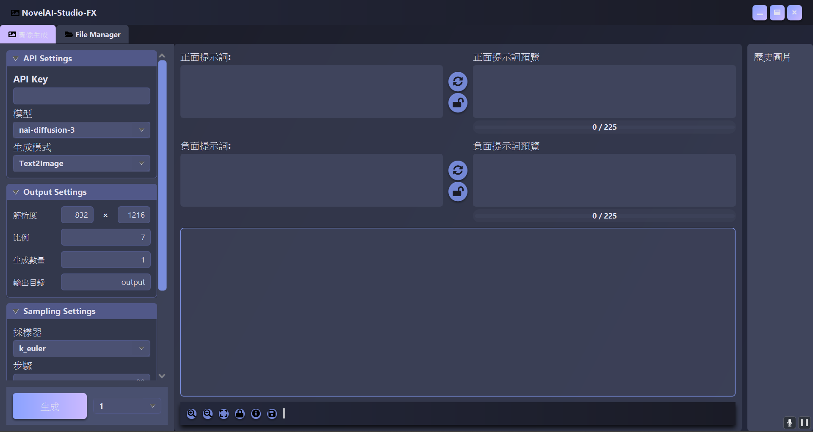
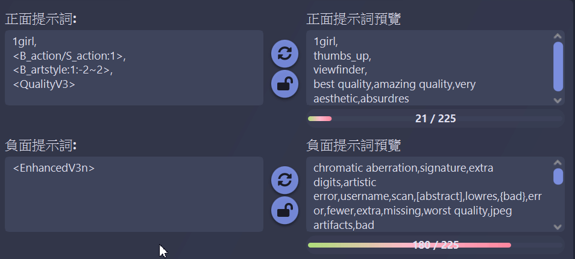

# 🎨 NovelAI-Studio-FX - 你的 AI 藝術創作夥伴

  
  
  
  

---

NovelAI-Studio-FX 是基於 JavaFX 開發的應用程序，為 NovelAI 用戶提供了一個直觀、功能豐富的界面，讓你的 AI 繪畫工作變得更加簡單和有趣。無論你是經驗豐富的 AI 藝術家，還是剛開始探索 NovelAI 的新手，NovelAI-Studio-FX 都能夠滿足你的需求。

## 🚀 快速開始

1. [下載 JDK-21或以上的版本](https://adoptium.net/en-GB/) （此步驟為安裝運行所需環境）(在安裝環境時請勾選第三個環境變數的選項)
2. [下載最新版本](https://github.com/zxzinn/NovelAI-Studio-FX/releases)
3. 將下載下來的 `NovelAI-Studio-FX.jar` 放到合適的磁盤位置位置運行 
4. 輸入你的 NovelAI API 密鑰
5. 開始創作屬於你的 AI 藝術品！

## 🌟 主要特點

- 🎨 **多樣化的生成模式**：支持文字到圖像（Text2Image）和圖像到圖像（Image2Image）生成
- 🖼️ **可高度自定義的生成參數**：精確控制圖像尺寸、採樣器、生成步驟等參數
- 📁 **強大的文件管理系統**：內建文件管理器，靈活操作生成後的圖片以及預定義的嵌入集
- 🔄 **實時提示詞預覽和優化**：可分類別靈活地隨機你想要的類型的 Prompt，更精確的控制隨機範圍；即時查看處理後的提示詞效果，內置 Prompt Token 計數器
- 📊 **直觀的歷史記錄與圖像預覽**：瀏覽創作歷史，隨心縮放和拖動您生成的每一張圖片
- 🧩 **可自定義的庫和靈活的嵌入系統**：可任意調整你想要 Random 的庫 Prompt 文件；支持自定義嵌入格式、隨機提示詞和動態權重；新增自動填充模塊，對於調用的庫文件可以不用輸入全稱，直接在下拉框中選取即可
- 🔧 **多種內建工具集**：嵌入TXT合併去重功能；圖片元數據清除工具

## 📸 應用界面預覽

<tr>
<td></td>
</tr>

## 💡 進階使用技巧

- 你可以下載我們製作的 [Embed](https://github.com/zxzinn/NovelAI-Studio-FX/tree/dev-master/embeds) 庫文件來快速上手,將該文件夾放入根目錄下即可
- 使用嵌入語法 `<keyword>` 來引用預定義的提示詞集合
- 使用 `<keyword1(使用的嵌入文件名):keyword2(隨機取樣數):keyword3(隨機權重)>` 
- 例如：`<artist:1~3:-2~2>` 即爲調用根目錄下的 artist.txt ，從中隨機抽取一至三個 Prompt ,並對每一個 Prompt 隨機賦予`{{}}`至`[[]]`的權重等級
- 若需要調用子文件夾内的文件，需要加入`/`符號，例如`<B_action/S_basicaction>`
<tr>
  <td></td>
</tr>

- 利用文件管理器的批量功能來同時處理多個文件

## 🚧 未來計畫
- [ ] 實現對圖生圖的優化，包含Director tool
- [ ] 實現局部重繪功能
- [ ] 一般tag的自動補全
- [ ] 串接輕量化的AI，優化使用者的提示詞
- [ ] 研究 Tokenizer 語意分析原理
- [ ] 提供更多主題選擇
- [ ] 優化介面配置和靈活度
- [ ] 添加更多的圖像後處理選項
- [ ] 擴充通用的提示詞庫
- [ ] 新增支持更多的使用界面語言
- [ ] 優化性能，提高生成的效率
- [ ] 優化程式碼，使其更方便社群開發
- [ ] 更嚴謹的錯誤處理

## 📜 許可證

NovelAI-Studio-FX 採用 [MIT 許可證](LICENSE)。

## 📞 聯繫
<table>
  <tr>
    <td align="center">
      <a href="https://github.com/zxzinn">
         
        <b>zxzinn</b>
      </a> 
      Discord: zxzinn 
      QQ: 732058430 
      Telegram: zxzinn 
    </td>
  </tr>
</table>

## 🙌 支持我們

如果你喜歡 NovelAI-Studio-FX，請給我們一個 ⭐️！你的支持是我們持續改進的最大動力。

## 🙏 致謝
<table>
  <tr>
    <td align="center">
      <a href="https://github.com/TwilitAtri">
         
        <b>TwilitAtri</b>
      </a> 
      Discord: culachino 
      QQ: 1633565574
    </td>
    <!-- 添加更多貢獻者、參考兩個td間的格式-->
  </tr>
</table>
---
